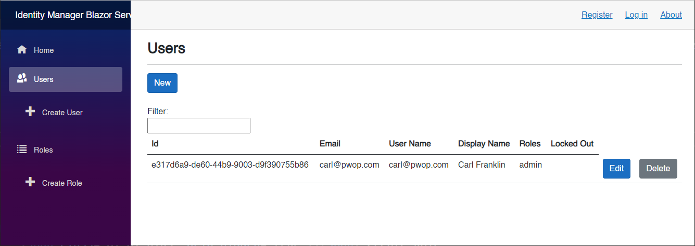
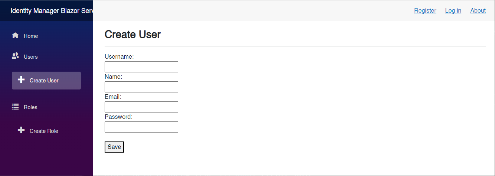
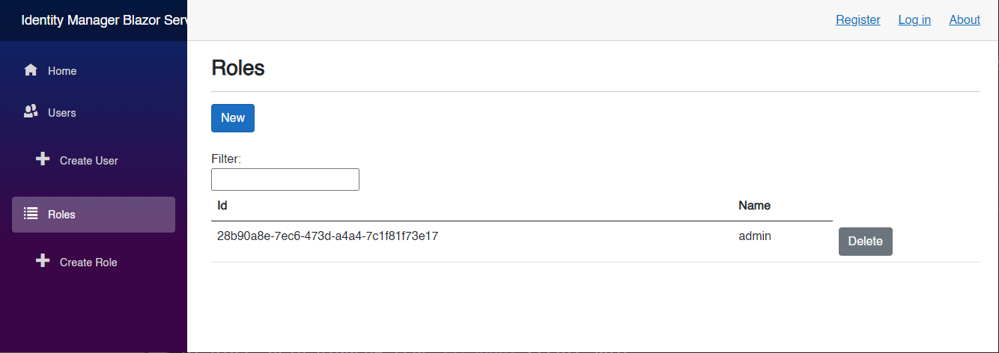
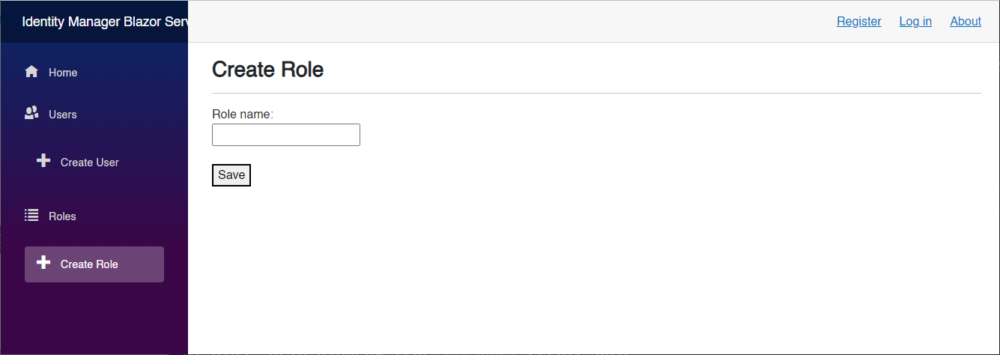
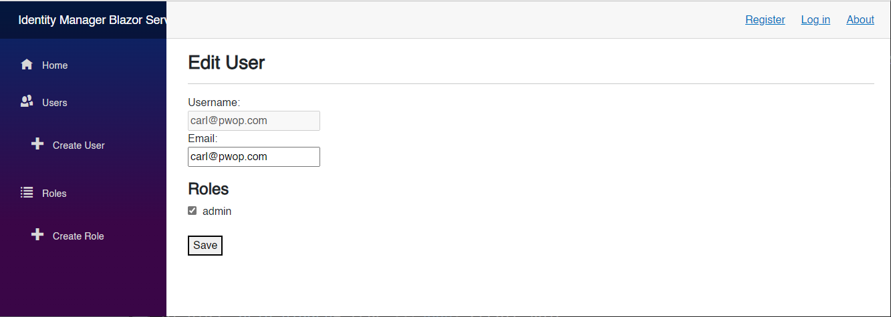
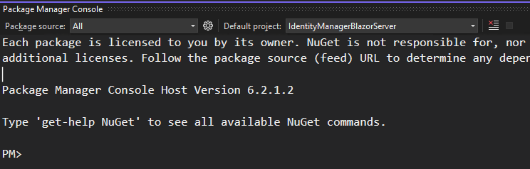
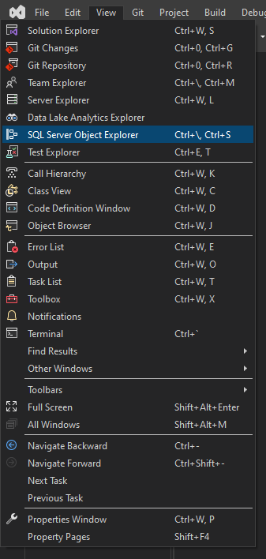
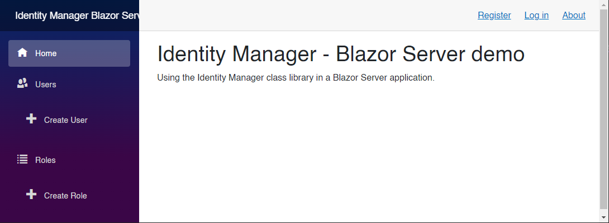

# Table of Contents

- [Table of Contents](#table-of-contents)
  - [Introduction](#introduction)
  - [Prerequisites](#prerequisites)
    - [.NET 6.0](#net-60)
    - [Visual Studio 2022](#visual-studio-2022)
  - [Demo](#demo)
    - [Create a `netstandard` Class Library](#create-a-netstandard-class-library)
    - [Create a Blazor Server Application](#create-a-blazor-server-application)
  - [Summary](#summary)
  - [Complete Code](#complete-code)
  - [Resources](#resources)

## Introduction

In this demo, we are going to build a `netstandard` class library based on the `GitHub` repo by `mguinness` that was shown in episodes [Basic Authentication and Authorization in Blazor Server: Carl Franklin's Blazor Train ep 26 ](https://www.youtube.com/watch?v=mbNFscKBsy8&list=PL8h4jt35t1wjvwFnvcB2LlYL4jLRzRmoz&index=30&t=790s), and [Basic Authentication and Authorization in Blazor Web Assembly: Carl Franklin's Blazor Train ep 27](https://www.youtube.com/watch?v=I3A1R-oBK7c&list=PL8h4jt35t1wjvwFnvcB2LlYL4jLRzRmoz&index=31), and that you can find [here](https://github.com/mguinness/IdentityManagerUI).

Then, we are going to build a Blazor Server application, and make use of the `netstandard` class library.

The end results will look like this:



  

  

  

  

## Prerequisites

The following prerequisites are needed for this demo.

### .NET 6.0

Download the latest version of the .NET 6.0 SDK [here](https://dotnet.microsoft.com/en-us/download).

### Visual Studio 2022

For this demo, we are going to use the latest version of [Visual Studio 2022](https://visualstudio.microsoft.com/vs/community/). 

## Demo

In the following demo we will first create a `netstandard` class library, based on the `GitHub` repo [mguinness/IdentityManagerUI](https://github.com/mguinness/IdentityManagerUI), then we are going to build a Blazor Server application, to make use of the `netstandard` class library.

### Create a `netstandard` Class Library

Open Visual Studio 2022, and create a `Class Library` project called `IdentityManagerLibrary`

  

  

  

Open *IdentityManagerLibrary.csproj* and change it to the following:

```xml
<Project Sdk="Microsoft.NET.Sdk">

	<PropertyGroup>
		<TargetFramework>netstandard2.1</TargetFramework>
		<Nullable>enable</Nullable>
	</PropertyGroup>

	<ItemGroup>
		<PackageReference Include="Microsoft.AspNetCore.Identity.EntityFrameworkCore" Version="3.1.27" />
	</ItemGroup>

</Project>
```

Add the following classes:

1. *ApplicationRole.cs*: Custom implementation of IdentityRole.
1. *ApplicationUser.cs*: Custom implementation of IdentityUser.
1. *Extensions.cs*: Extensions class to provide a useful method to concatenates all IdentityError descriptions into a single string.
1. *Manager.cs*: Provide all the CRUD operations against the `ASP.NET Core Identity` tables.
1. *Response.cs*: General response object.
1. *Role.cs*: Role model.
1. *User.cs*: User model.

Add the following code to each class:

File *ApplicationRole.cs*:

```csharp
using System.Collections.Generic;
using Microsoft.AspNetCore.Identity;

namespace IdentityManagerLibrary
{
    /// <summary>
    /// Custom implementation of IdentityRole.
    /// </summary>
    public class ApplicationRole : IdentityRole
    {
        public ApplicationRole() { }

        public ApplicationRole(string roleName) : base(roleName) { }

        public virtual ICollection<IdentityRoleClaim<string>>? Claims { get; set; }
    }
}
```

File *ApplicationUser.cs*:

```csharp
using System.Collections.Generic;
using Microsoft.AspNetCore.Identity;

namespace IdentityManagerLibrary
{
    /// <summary>
    /// Custom implementation of IdentityUser.
    /// </summary>
    public class ApplicationUser : IdentityUser
    {
        public virtual ICollection<IdentityUserRole<string>>? Roles { get; set; }
        public virtual ICollection<IdentityUserClaim<string>>? Claims { get; set; }
    }
}
```

File *Extensions.cs*:

```csharp
using System.Collections.Generic;
using Microsoft.AspNetCore.Identity;

namespace IdentityManagerLibrary
{
    public static class Extensions
    {
        /// <summary>
        /// Extension method that takes a collection of IEnumerable<IdentityError> and 
        /// concatenates all error descriptions into a string.
        /// </summary>
        /// <param name="errors">Collection of IdentityError objects.</param>
        /// <returns>A string containing all error messages in the collection.</returns>
        public static string GetAllMessages(this IEnumerable<IdentityError> errors)
        {
            var result = string.Empty;

            if (errors == null)
                return result;

            foreach (var error in errors)
            {
                result += string.IsNullOrEmpty(result) ? string.Empty : " ";
                result += error.Description;
            }

            return result;
        }
    }
}
```

File *Response.cs*:

```csharp
namespace IdentityManagerLibrary
{
    /// <summary>
    /// General response object.
    /// </summary>    
    public class Response
    {
        public bool Success { get; internal set; } = false;
        public string Messages { get; internal set; } = string.Empty;
    }
}
```

File *Role.cs*:

```csharp
using System.Collections.Generic;

namespace IdentityManagerLibrary
{
    /// <summary>
    /// Role model.
    /// </summary>    
    public class Role
    {
        public string? Id { get; set; }
        public string? Name { get; set; }
        public IEnumerable<KeyValuePair<string, string>>? Claims { get; set; }
    }
}
```

File *User.cs*:

```csharp
using System.Collections.Generic;

namespace IdentityManagerLibrary
{
    /// <summary>
    /// User model.
    /// </summary>
    public class User
    {
        public string? Id { get; set; }
        public string? Email { get; set; }
        public string? LockedOut { get; set; }
        public IEnumerable<string>? Roles { get; set; }
        public IEnumerable<KeyValuePair<string, string>>? Claims { get; set; }
        public string? DisplayName { get; set; }
        public string? UserName { get; set; }
    }
}
```

File *Manager.cs*:

This is the most important file of the class library, which provides the following methods:

1. `GetUsers`: Returns a collection of users from the database.
1. `CreateUser`: Create a user in the database.
1. `GetUser`: Get user by ID.
1. `UpdateUser`: Update the user.
1. `DeleteUser`: Delete user by ID.
1. `ResetPassword`: Reset user password.
1. `GetRoles`: Get user roles.
1. `CreateRole`: Create role.
1. `UpdateRole`: Update role.
1. `DeleteRole`: Delete role.

```csharp
using System;
using System.Collections.Generic;
using System.Linq;
using Microsoft.AspNetCore.Identity;
using Microsoft.EntityFrameworkCore;
using System.Security.Claims;
using System.Reflection;
using System.Threading.Tasks;

namespace IdentityManagerLibrary
{
    /// <summary>
    /// Provide all the CRUD operations against the ASP.NET Core Identity tables.
    /// </summary>
    public class Manager
    {
        private readonly UserManager<ApplicationUser> _userManager;
        private readonly RoleManager<ApplicationRole> _roleManager;
        /// <summary>
        /// Contains an updated list of all Roles in the database.
        /// </summary>
        public Dictionary<string, string> Roles;
        public readonly Dictionary<string, string> ClaimTypes;

        /// <summary>
        /// Manager constructor that sets the userManager, roleManager, and ClaimTypes.
        /// </summary>
        /// <param name="userManager">Exposes CRUD operations for users from the Microsoft.Extensions.Identity.Core assembly in the Microsoft.AspNetCore.Identity namespace.</param>
        /// <param name="roleManager">Exposes CRUD operations for roles from the Microsoft.Extensions.Identity.Core assembly in the Microsoft.AspNetCore.Identity namespace.</param>
        public Manager(UserManager<ApplicationUser> userManager, RoleManager<ApplicationRole> roleManager)
        {
            _userManager = userManager;
            _roleManager = roleManager;

            // Set all the roles in the database, ordered by Name ascending.
            Roles = roleManager.Roles.OrderBy(r => r.Name).ToDictionary(r => r.Id, r => r.Name);

            var fieldInfo = typeof(ClaimTypes).GetFields(BindingFlags.Static | BindingFlags.Public);

            // Set all the claim types as defined in the System.Security.Claims constants.
            ClaimTypes = fieldInfo.ToDictionary(i => i.Name, i => (string)i.GetValue(null));
        }

        /// <summary>
        /// Returns a collection of users from the database.
        /// </summary>
        /// <param name="filter">When provided, filter the users based on partial matches of email, and username.</param>
        /// <returns>A collection of User objects.</returns>
        public IEnumerable<User> GetUsers(string? filter = null)
        {
            filter = filter?.Trim();

            // Get all users, including roles, and claims, from the database.
            var users = _userManager.Users.Include(u => u.Roles).Include(u => u.Claims);

            // Filter the user list, and order by username ascending.
            var query = users.Where(u =>
                (string.IsNullOrWhiteSpace(filter) || u.Email.Contains(filter)) ||
                (string.IsNullOrWhiteSpace(filter) || u.UserName.Contains(filter))
            ).OrderBy(u => u.UserName);

            // Execute the query and set properties.
            var result = query.ToArray().Select(u => new User
            {
                Id = u.Id,
                Email = u.Email,
                LockedOut = u.LockoutEnd == null ? string.Empty : "Yes",
                Roles = u.Roles.Select(r => Roles[r.RoleId]),
                //Key/Value props not camel cased (https://github.com/dotnet/corefx/issues/41309)
                Claims = u.Claims.Select(c => new KeyValuePair<string, string>(ClaimTypes.Single(x => x.Value == c.ClaimType).Key, c.ClaimValue)),
                DisplayName = u.Claims?.FirstOrDefault(c => c.ClaimType == System.Security.Claims.ClaimTypes.Name)?.ClaimValue,
                UserName = u.UserName
            });

            return result;
        }

        /// <summary>
        /// Create a user in the database.
        /// </summary>
        /// <param name="userName">Username for the account.</param>
        /// <param name="name">Name of the user.</param>
        /// <param name="email">Email of the user.</param>
        /// <param name="password">Password for the user.</param>
        /// <returns>Response object.</returns>
        /// <exception cref="ArgumentNullException">When any of the arguments are not provided, an ArgumentNullException will be thrown.</exception>
        public async Task<Response> CreateUser(string userName, string name, string email, string password)
        {
            if (string.IsNullOrWhiteSpace(userName))
                throw new ArgumentNullException("userName", "The argument userName cannot be null or empty.");

            if (string.IsNullOrWhiteSpace(name))
                throw new ArgumentNullException("name", "The argument name cannot be null or empty.");

            if (string.IsNullOrWhiteSpace(email))
                throw new ArgumentNullException("email", "The argument email cannot be null or empty.");

            if (string.IsNullOrWhiteSpace(password))
                throw new ArgumentNullException("password", "The argument password cannot be null or empty.");

            var response = new Response();
            var user = new ApplicationUser() { Email = email, UserName = userName };

            // Create user.
            var result = await _userManager.CreateAsync(user, password);

            if (result.Succeeded)
            {
                if (name != null)
                    await _userManager.AddClaimAsync(user, new Claim(System.Security.Claims.ClaimTypes.Name, name));
            }
            else
            {
                response.Messages = result.Errors.GetAllMessages();
            }

            response.Success = result.Succeeded;

            return response;
        }

        /// <summary>
        /// Get user by ID.
        /// </summary>
        /// <param name="id">ID of the user.</param>
        /// <returns>Returns the ApplicationUser object.</returns>
        /// <exception cref="ArgumentNullException">When any of the arguments are not provided, an ArgumentNullException will be thrown.</exception>
        /// <exception cref="Exception">Throws an exception when the user is not found.</exception>
        public async Task<ApplicationUser> GetUser(string id)
        {
            if (string.IsNullOrWhiteSpace(id))
                throw new ArgumentNullException("id", "The argument id cannot be null or empty.");

            // Gets the user.
            var user = await _userManager.FindByIdAsync(id);

            if (user == null)
                throw new Exception("User not found.");

            return user;
        }

        /// <summary>
        /// Update the user.
        /// </summary>
        /// <param name="id">ID of the user.</param>
        /// <param name="email">Email of the user.</param>
        /// <param name="locked">Weather or not the user account is locked.</param>
        /// <param name="roles">List of roles the user should be added to.</param>
        /// <param name="claims">List of claims the user should be added to.</param>
        /// <returns>Response object.</returns>
        /// <exception cref="ArgumentNullException">When any of the arguments is not provided, an ArgumentNullException will be thrown.</exception>
        public async Task<Response> UpdateUser(string id, string email, bool locked, string[] roles, List<KeyValuePair<string, string>> claims)
        {
            if (string.IsNullOrWhiteSpace(id))
                throw new ArgumentNullException("id", "The argument id cannot be null or empty.");

            if (string.IsNullOrWhiteSpace(email))
                throw new ArgumentNullException("email", "The argument email cannot be null or empty.");

            if (roles == null)
                throw new ArgumentNullException("roles", "The argument roles cannot be null.");

            var response = new Response();

            try
            {
                // Gets the user by ID.
                var user = await _userManager.FindByIdAsync(id);
                if (user == null)
                    response.Messages = "User not found.";

                // Update only the updatable properties.
                user!.Email = email;
                user.LockoutEnd = locked ? DateTimeOffset.MaxValue : default(DateTimeOffset?);

                // Update user.
                var result = await _userManager.UpdateAsync(user);

                if (result.Succeeded)
                {
                    response.Messages += $"Updated user {user.UserName}";

                    // Get the current user roles.
                    var userRoles = await _userManager.GetRolesAsync(user);

                    // Add specified user roles.
                    foreach (string role in roles.Except(userRoles))
                        await _userManager.AddToRoleAsync(user, role);

                    // Remove any roles, not specified, from the user. 
                    foreach (string role in userRoles.Except(roles))
                        await _userManager.RemoveFromRoleAsync(user, role);

                    // Get the current user claims.
                    var userClaims = await _userManager.GetClaimsAsync(user);

                    // Add specified user claims.
                    foreach (var kvp in claims.Where(a => !userClaims.Any(b => ClaimTypes[a.Key] == b.Type && a.Value == b.Value)))
                        await _userManager.AddClaimAsync(user, new Claim(ClaimTypes[kvp.Key], kvp.Value));

                    // Remove any claims, not specified, from the user. 
                    foreach (var claim in userClaims.Where(a => !claims.Any(b => a.Type == ClaimTypes[b.Key] && a.Value == b.Value)))
                        await _userManager.RemoveClaimAsync(user, claim);
                }
                else
                    response.Messages = result.Errors.GetAllMessages();

                response.Success = result.Succeeded;
            }
            catch (Exception ex)
            {
                response.Messages = $"Failure updating user {id}: {ex.Message}";
            }

            return response;
        }

        /// <summary>
        /// Delete user by ID.
        /// </summary>
        /// <param name="id">ID of the user.</param>
        /// <returns>Response object.</returns>
        /// <exception cref="ArgumentNullException">When any of the arguments are not provided, an ArgumentNullException will be thrown.</exception>
        public async Task<Response> DeleteUser(string id)
        {
            if (string.IsNullOrWhiteSpace(id))
                throw new ArgumentNullException("id", "The argument id cannot be null or empty.");

            var response = new Response();

            try
            {
                // Get the user.
                var user = await _userManager.FindByIdAsync(id);

                if (user == null)
                    response.Messages = "User not found.";

                // Delete the user.
                var result = await _userManager.DeleteAsync(user!);

                if (result.Succeeded)
                    response.Messages = $"Deleted user {user!.UserName}.";
                else
                    response.Messages = result.Errors.GetAllMessages();

                response.Success = result.Succeeded;
            }
            catch (Exception ex)
            {
                response.Messages = $"Failure deleting user {id}: {ex.Message}";
            }

            return response;
        }

        /// <summary>
        /// Reset user password.
        /// </summary>
        /// <param name="id">ID of the user.</param>
        /// <param name="password">Password for the user.</param>
        /// <param name="verify">Password for verification purposes.</param>
        /// <returns>Response object.</returns>
        /// <exception cref="ArgumentNullException">When any of the arguments are not provided, an ArgumentNullException will be thrown.</exception>
        public async Task<Response> ResetPassword(string id, string password, string verify)
        {
            if (string.IsNullOrWhiteSpace(id))
                throw new ArgumentNullException("id", "The argument id cannot be null or empty.");

            if (string.IsNullOrWhiteSpace(password))
                throw new ArgumentNullException("password", "The argument password cannot be null or empty.");

            if (string.IsNullOrWhiteSpace(verify))
                throw new ArgumentNullException("verify", "The argument verify cannot be null or empty.");

            var response = new Response();

            try
            {
                if (password != verify)
                    response.Messages = "Passwords entered do not match.";

                // Get the user.
                var user = await _userManager.FindByIdAsync(id);

                if (user == null)
                    response.Messages = "User not found.";

                // Delete existing password if it exists.
                if (await _userManager.HasPasswordAsync(user!))
                    await _userManager.RemovePasswordAsync(user!);

                // Add new password for the user.
                var result = await _userManager.AddPasswordAsync(user!, password);

                if (result.Succeeded)
                {
                    response.Messages = $"Password reset for {user!.UserName}.";
                }
                else
                    response.Messages = result.Errors.GetAllMessages();
            }
            catch (Exception ex)
            {
                response.Messages = $"Failed password reset for user {id}: {ex.Message}";
            }

            return response;
        }

        /// <summary>
        /// Get user roles.
        /// </summary>
        /// <param name="filter">When provided, filter the roles based on partial matches of role name.</param>
        /// <returns>A collection of role objects.</returns>
        public IEnumerable<Role> GetRoles(string? filter = null)
        {
            // Get all roles, including claims, from the database.
            var roles = _roleManager.Roles.Include(r => r.Claims);

            // Filter role list, and order by name ascending.
            var query = roles.Where(r =>
                (string.IsNullOrWhiteSpace(filter) || r.Name.Contains(filter))
            ).OrderBy(r => r.Name); ;

            // Execute the query and set properties.
            var result = query.ToArray().Select(r => new Role
            {
                Id = r.Id,
                Name = r.Name,
                //Key/Value props not camel cased (https://github.com/dotnet/corefx/issues/41309)
                Claims = r.Claims.Select(c => new KeyValuePair<string, string>(ClaimTypes.Single(x => x.Value == c.ClaimType).Key, c.ClaimValue))
            });

            return result;
        }

        /// <summary>
        /// Create role.
        /// </summary>
        /// <param name="name">Role name.</param>
        /// <returns>Response object.</returns>
        /// <exception cref="ArgumentNullException">When any of the arguments are not provided, an ArgumentNullException will be thrown.</exception>
        public async Task<Response> CreateRole(string name)
        {
            if (string.IsNullOrWhiteSpace(name))
                throw new ArgumentNullException("name", "The argument name cannot be null or empty.");

            var response = new Response();
            var role = new ApplicationRole(name);

            // Create role.
            var result = await _roleManager.CreateAsync(role);

            if (!result.Succeeded)
            {
                response.Messages = result.Errors.GetAllMessages();
            }

            response.Success = result.Succeeded;

            // Update the current collection of roles in the database.
            Roles = _roleManager.Roles.OrderBy(r => r.Name).ToDictionary(r => r.Id, r => r.Name);

            return response;
        }

        /// <summary>
        /// Update role.
        /// </summary>
        /// <param name="id">ID of the role.</param>
        /// <param name="name">Name of the role.</param>
        /// <param name="claims">List of claims the role should be added to.</param>
        /// <returns>Response object.</returns>
        /// <exception cref="ArgumentNullException">When any of the arguments are not provided, an ArgumentNullException will be thrown.</exception>
        public async Task<Response> UpdateRole(string id, string name, List<KeyValuePair<string, string>> claims)
        {
            if (string.IsNullOrWhiteSpace(id))
                throw new ArgumentNullException("id", "The argument id cannot be null or empty.");

            if (string.IsNullOrWhiteSpace(name))
                throw new ArgumentNullException("name", "The argument name cannot be null or empty.");

            var response = new Response();

            try
            {
                // Get role.
                var role = await _roleManager.FindByIdAsync(id);

                if (role == null)
                    response.Messages = "Role not found.";

                // Update updatable properties.
                role!.Name = name;

                // Update role.
                var result = await _roleManager.UpdateAsync(role);

                if (result.Succeeded)
                {
                    response.Messages += $"Updated role {role.Name}";

                    // Get the current role claims.
                    var roleClaims = await _roleManager.GetClaimsAsync(role);

                    // Add specified role claims.
                    foreach (var kvp in claims.Where(a => !roleClaims.Any(b => ClaimTypes[a.Key] == b.Type && a.Value == b.Value)))
                        await _roleManager.AddClaimAsync(role, new Claim(ClaimTypes[kvp.Key], kvp.Value));

                    // Remove any claims, not specified, from the role.
                    foreach (var claim in roleClaims.Where(a => !claims.Any(b => a.Type == ClaimTypes[b.Key] && a.Value == b.Value)))
                        await _roleManager.RemoveClaimAsync(role, claim);
                }
                else
                    response.Messages = result.Errors.GetAllMessages();

                response.Success = result.Succeeded;
            }
            catch (Exception ex)
            {
                response.Messages = $"Failure updating role {id}: {ex.Message}";
            }

            // Update the current collection of roles in the database.
            Roles = _roleManager.Roles.OrderBy(r => r.Name).ToDictionary(r => r.Id, r => r.Name);

            return response;
        }

        /// <summary>
        /// Delete role.
        /// </summary>
        /// <param name="id">ID of the role.</param>
        /// <returns>Response object.</returns>
        /// <exception cref="ArgumentNullException">When any of the arguments are not provided, an ArgumentNullException will be thrown.</exception>
        public async Task<Response> DeleteRole(string id)
        {
            if (string.IsNullOrWhiteSpace(id))
                throw new ArgumentNullException("id", "The argument id cannot be null or empty.");

            var response = new Response();

            try
            {
                // Get role.
                var role = await _roleManager.FindByIdAsync(id);

                if (role == null)
                    response.Messages = "Role not found.";

                // Delete role.
                var result = await _roleManager.DeleteAsync(role!);

                if (result.Succeeded)
                    response.Messages = $"Deleted role {role!.Name}.";
                else
                    response.Messages = result.Errors.GetAllMessages();

                response.Success = result.Succeeded;
            }
            catch (Exception ex)
            {
                response.Messages = $"Failure deleting role {id}: {ex.Message}";
            }

            // Update the current collection of roles in the database.
            Roles = _roleManager.Roles.OrderBy(r => r.Name).ToDictionary(r => r.Id, r => r.Name);

            return response;
        }
    }
}
```

> :blue_book: Notice that *Manager.cs* is the most important file, which contains all the `CRUD` operations performed against the `ASP.NET Core Identity` tables.

### Create a Blazor Server Application

Now, let's create a Blazor Server Application called *IdentityManagerBlazorServer.csproj* that makes use of the `netstandard` class library we just built, to add, list, and delete users and roles.

  


Make sure you set the `Authentication type`  to `Individual Accounts`""


Delete the following files as we are not going to need them:

1. *WeatherForecast.cs*
2. *WeatherForecastService.cs*
3. *Counter.razor*
4. *FetchData.razor*
5. *SurveyPrompt.razor*

  

Delete the following line from the *Program.cs* file:

```csharp
builder.Services.AddSingleton<WeatherForecastService>();
```

Add a project reference from `IdentityManagerBlazorServer` to `IdentityManagerLibrary`

Add the following to *_Imports.razor*:

```
@using IdentityManagerLibrary
```

Modify the *appsettings.json* file with this code:

```json
{
  "ConnectionStrings": {
    "DefaultConnection": "Server=(localdb)\\mssqllocaldb;Database=IdentityManager;Trusted_Connection=True;MultipleActiveResultSets=true"
  },
  "Logging": {
    "LogLevel": {
      "Default": "Information",
      "Microsoft.AspNetCore": "Warning"
    }
  },
  "AllowedHosts": "*"
}
```

Modify the *Program.cs* file with the following code:

```csharp
global using IdentityManagerLibrary;
using IdentityManagerBlazorServer.Areas.Identity;
using IdentityManagerBlazorServer.Data;
using Microsoft.AspNetCore.Components.Authorization;
using Microsoft.AspNetCore.Identity;
using Microsoft.EntityFrameworkCore;

var builder = WebApplication.CreateBuilder(args);

var connectionString = builder.Configuration.GetConnectionString("DefaultConnection");
builder.Services.AddDbContext<ApplicationDbContext>(options =>
    options.UseSqlServer(connectionString));
builder.Services.AddDatabaseDeveloperPageExceptionFilter();

builder.Services.AddDefaultIdentity<ApplicationUser>(options => options.SignIn.RequireConfirmedAccount = true)
    .AddRoles<ApplicationRole>()
    .AddEntityFrameworkStores<ApplicationDbContext>();

builder.Services.AddRazorPages();
builder.Services.AddServerSideBlazor();
builder.Services.AddScoped<AuthenticationStateProvider, RevalidatingIdentityAuthenticationStateProvider<IdentityUser>>();
builder.Services.AddScoped<Manager>();

var app = builder.Build();

// Configure the HTTP request pipeline.
if (app.Environment.IsDevelopment())
{
    app.UseMigrationsEndPoint();
}
else
{
    app.UseExceptionHandler("/Error");
    // The default HSTS value is 30 days. You may want to change this for production scenarios, see https://aka.ms/aspnetcore-hsts.
    app.UseHsts();
}

app.UseHttpsRedirection();

app.UseStaticFiles();

app.UseRouting();

app.UseAuthentication();
app.UseAuthorization();

app.MapControllers();
app.MapBlazorHub();
app.MapFallbackToPage("/_Host");

app.Run();
```

>:blue_book: Notice the code `builder.Services.AddScoped<Manager>();` which will allow our pages to inject an instance of the `Manager` provided by the `IdentityManager` class library, to be able to call it's CRUD operations available.

Open the *ApplicationDbContext.cs* file, and replace it with the following:

```c#
using Microsoft.AspNetCore.Identity.EntityFrameworkCore;
using Microsoft.EntityFrameworkCore;

namespace IdentityManagerBlazorServer.Data
{
    public class ApplicationDbContext : IdentityDbContext<ApplicationUser, ApplicationRole, string>
    {
        public ApplicationDbContext(DbContextOptions<ApplicationDbContext> options)
            : base(options)
        {
        }

        protected override void OnModelCreating(ModelBuilder builder)
        {
            base.OnModelCreating(builder);

            builder.Entity<ApplicationUser>()
                .HasMany(p => p.Roles).WithOne()
                .HasForeignKey(p => p.UserId)
                .IsRequired()
                .OnDelete(DeleteBehavior.Cascade);

            builder.Entity<ApplicationUser>()
                .HasMany(e => e.Claims)
                .WithOne().HasForeignKey(e => e.UserId)
                .IsRequired()
                .OnDelete(DeleteBehavior.Cascade);

            builder.Entity<ApplicationRole>()
                .HasMany(r => r.Claims).WithOne()
                .HasForeignKey(r => r.RoleId)
                .IsRequired()
                .OnDelete(DeleteBehavior.Cascade);
        }
    }
}
```

Set `IdentityManagerBlazorServer` as the startup project.

Open the `Package Manager Console` and set the `Default project` to `IdentityManagerBlazorServer`



Run `update-database` to create the `IdentityManager` database.

You should see the following output:

```powershell
PM> update-database
Build started...
Build succeeded.
Microsoft.EntityFrameworkCore.Infrastructure[10403]
      Entity Framework Core 6.0.7 initialized 'ApplicationDbContext' using provider 'Microsoft.EntityFrameworkCore.SqlServer:6.0.7' with options: None
Microsoft.EntityFrameworkCore.Database.Command[20101]
      Executed DbCommand (146ms) [Parameters=[], CommandType='Text', CommandTimeout='60']
      CREATE DATABASE [IdentityManager];
Microsoft.EntityFrameworkCore.Database.Command[20101]
      Executed DbCommand (73ms) [Parameters=[], CommandType='Text', CommandTimeout='60']
      IF SERVERPROPERTY('EngineEdition') <> 5
      BEGIN
          ALTER DATABASE [IdentityManager] SET READ_COMMITTED_SNAPSHOT ON;
      END;
Microsoft.EntityFrameworkCore.Database.Command[20101]
      Executed DbCommand (4ms) [Parameters=[], CommandType='Text', CommandTimeout='30']
      SELECT 1
Microsoft.EntityFrameworkCore.Database.Command[20101]
      Executed DbCommand (4ms) [Parameters=[], CommandType='Text', CommandTimeout='30']
      CREATE TABLE [__EFMigrationsHistory] (
          [MigrationId] nvarchar(150) NOT NULL,
          [ProductVersion] nvarchar(32) NOT NULL,
          CONSTRAINT [PK___EFMigrationsHistory] PRIMARY KEY ([MigrationId])
      );
Microsoft.EntityFrameworkCore.Database.Command[20101]
      Executed DbCommand (0ms) [Parameters=[], CommandType='Text', CommandTimeout='30']
      SELECT 1
Microsoft.EntityFrameworkCore.Database.Command[20101]
      Executed DbCommand (9ms) [Parameters=[], CommandType='Text', CommandTimeout='30']
      SELECT OBJECT_ID(N'[__EFMigrationsHistory]');
Microsoft.EntityFrameworkCore.Database.Command[20101]
      Executed DbCommand (2ms) [Parameters=[], CommandType='Text', CommandTimeout='30']
      SELECT [MigrationId], [ProductVersion]
      FROM [__EFMigrationsHistory]
      ORDER BY [MigrationId];
Microsoft.EntityFrameworkCore.Migrations[20402]
      Applying migration '00000000000000_CreateIdentitySchema'.
Applying migration '00000000000000_CreateIdentitySchema'.
Microsoft.EntityFrameworkCore.Database.Command[20101]
      Executed DbCommand (1ms) [Parameters=[], CommandType='Text', CommandTimeout='30']
      CREATE TABLE [AspNetRoles] (
          [Id] nvarchar(450) NOT NULL,
          [Name] nvarchar(256) NULL,
          [NormalizedName] nvarchar(256) NULL,
          [ConcurrencyStamp] nvarchar(max) NULL,
          CONSTRAINT [PK_AspNetRoles] PRIMARY KEY ([Id])
      );
Microsoft.EntityFrameworkCore.Database.Command[20101]
      Executed DbCommand (1ms) [Parameters=[], CommandType='Text', CommandTimeout='30']
      CREATE TABLE [AspNetUsers] (
          [Id] nvarchar(450) NOT NULL,
          [UserName] nvarchar(256) NULL,
          [NormalizedUserName] nvarchar(256) NULL,
          [Email] nvarchar(256) NULL,
          [NormalizedEmail] nvarchar(256) NULL,
          [EmailConfirmed] bit NOT NULL,
          [PasswordHash] nvarchar(max) NULL,
          [SecurityStamp] nvarchar(max) NULL,
          [ConcurrencyStamp] nvarchar(max) NULL,
          [PhoneNumber] nvarchar(max) NULL,
          [PhoneNumberConfirmed] bit NOT NULL,
          [TwoFactorEnabled] bit NOT NULL,
          [LockoutEnd] datetimeoffset NULL,
          [LockoutEnabled] bit NOT NULL,
          [AccessFailedCount] int NOT NULL,
          CONSTRAINT [PK_AspNetUsers] PRIMARY KEY ([Id])
      );
Microsoft.EntityFrameworkCore.Database.Command[20101]
      Executed DbCommand (1ms) [Parameters=[], CommandType='Text', CommandTimeout='30']
      CREATE TABLE [AspNetRoleClaims] (
          [Id] int NOT NULL IDENTITY,
          [RoleId] nvarchar(450) NOT NULL,
          [ClaimType] nvarchar(max) NULL,
          [ClaimValue] nvarchar(max) NULL,
          CONSTRAINT [PK_AspNetRoleClaims] PRIMARY KEY ([Id]),
          CONSTRAINT [FK_AspNetRoleClaims_AspNetRoles_RoleId] FOREIGN KEY ([RoleId]) REFERENCES [AspNetRoles] ([Id]) ON DELETE CASCADE
      );
Microsoft.EntityFrameworkCore.Database.Command[20101]
      Executed DbCommand (1ms) [Parameters=[], CommandType='Text', CommandTimeout='30']
      CREATE TABLE [AspNetUserClaims] (
          [Id] int NOT NULL IDENTITY,
          [UserId] nvarchar(450) NOT NULL,
          [ClaimType] nvarchar(max) NULL,
          [ClaimValue] nvarchar(max) NULL,
          CONSTRAINT [PK_AspNetUserClaims] PRIMARY KEY ([Id]),
          CONSTRAINT [FK_AspNetUserClaims_AspNetUsers_UserId] FOREIGN KEY ([UserId]) REFERENCES [AspNetUsers] ([Id]) ON DELETE CASCADE
      );
Microsoft.EntityFrameworkCore.Database.Command[20101]
      Executed DbCommand (1ms) [Parameters=[], CommandType='Text', CommandTimeout='30']
      CREATE TABLE [AspNetUserLogins] (
          [LoginProvider] nvarchar(128) NOT NULL,
          [ProviderKey] nvarchar(128) NOT NULL,
          [ProviderDisplayName] nvarchar(max) NULL,
          [UserId] nvarchar(450) NOT NULL,
          CONSTRAINT [PK_AspNetUserLogins] PRIMARY KEY ([LoginProvider], [ProviderKey]),
          CONSTRAINT [FK_AspNetUserLogins_AspNetUsers_UserId] FOREIGN KEY ([UserId]) REFERENCES [AspNetUsers] ([Id]) ON DELETE CASCADE
      );
Microsoft.EntityFrameworkCore.Database.Command[20101]
      Executed DbCommand (1ms) [Parameters=[], CommandType='Text', CommandTimeout='30']
      CREATE TABLE [AspNetUserRoles] (
          [UserId] nvarchar(450) NOT NULL,
          [RoleId] nvarchar(450) NOT NULL,
          CONSTRAINT [PK_AspNetUserRoles] PRIMARY KEY ([UserId], [RoleId]),
          CONSTRAINT [FK_AspNetUserRoles_AspNetRoles_RoleId] FOREIGN KEY ([RoleId]) REFERENCES [AspNetRoles] ([Id]) ON DELETE CASCADE,
          CONSTRAINT [FK_AspNetUserRoles_AspNetUsers_UserId] FOREIGN KEY ([UserId]) REFERENCES [AspNetUsers] ([Id]) ON DELETE CASCADE
      );
Microsoft.EntityFrameworkCore.Database.Command[20101]
      Executed DbCommand (2ms) [Parameters=[], CommandType='Text', CommandTimeout='30']
      CREATE TABLE [AspNetUserTokens] (
          [UserId] nvarchar(450) NOT NULL,
          [LoginProvider] nvarchar(128) NOT NULL,
          [Name] nvarchar(128) NOT NULL,
          [Value] nvarchar(max) NULL,
          CONSTRAINT [PK_AspNetUserTokens] PRIMARY KEY ([UserId], [LoginProvider], [Name]),
          CONSTRAINT [FK_AspNetUserTokens_AspNetUsers_UserId] FOREIGN KEY ([UserId]) REFERENCES [AspNetUsers] ([Id]) ON DELETE CASCADE
      );
Microsoft.EntityFrameworkCore.Database.Command[20101]
      Executed DbCommand (1ms) [Parameters=[], CommandType='Text', CommandTimeout='30']
      CREATE INDEX [IX_AspNetRoleClaims_RoleId] ON [AspNetRoleClaims] ([RoleId]);
Microsoft.EntityFrameworkCore.Database.Command[20101]
      Executed DbCommand (1ms) [Parameters=[], CommandType='Text', CommandTimeout='30']
      CREATE UNIQUE INDEX [RoleNameIndex] ON [AspNetRoles] ([NormalizedName]) WHERE [NormalizedName] IS NOT NULL;
Microsoft.EntityFrameworkCore.Database.Command[20101]
      Executed DbCommand (0ms) [Parameters=[], CommandType='Text', CommandTimeout='30']
      CREATE INDEX [IX_AspNetUserClaims_UserId] ON [AspNetUserClaims] ([UserId]);
Microsoft.EntityFrameworkCore.Database.Command[20101]
      Executed DbCommand (0ms) [Parameters=[], CommandType='Text', CommandTimeout='30']
      CREATE INDEX [IX_AspNetUserLogins_UserId] ON [AspNetUserLogins] ([UserId]);
Microsoft.EntityFrameworkCore.Database.Command[20101]
      Executed DbCommand (1ms) [Parameters=[], CommandType='Text', CommandTimeout='30']
      CREATE INDEX [IX_AspNetUserRoles_RoleId] ON [AspNetUserRoles] ([RoleId]);
Microsoft.EntityFrameworkCore.Database.Command[20101]
      Executed DbCommand (1ms) [Parameters=[], CommandType='Text', CommandTimeout='30']
      CREATE INDEX [EmailIndex] ON [AspNetUsers] ([NormalizedEmail]);
Microsoft.EntityFrameworkCore.Database.Command[20101]
      Executed DbCommand (1ms) [Parameters=[], CommandType='Text', CommandTimeout='30']
      CREATE UNIQUE INDEX [UserNameIndex] ON [AspNetUsers] ([NormalizedUserName]) WHERE [NormalizedUserName] IS NOT NULL;
Microsoft.EntityFrameworkCore.Database.Command[20101]
      Executed DbCommand (2ms) [Parameters=[], CommandType='Text', CommandTimeout='30']
      INSERT INTO [__EFMigrationsHistory] ([MigrationId], [ProductVersion])
      VALUES (N'00000000000000_CreateIdentitySchema', N'6.0.7');
Done.
```

You can see the created database and the Identity tables by opening the `SQL Server Object Explorer`.

  

  

Now let's add the *Users.razor* and *Roles.razor* pages under the *Pages* folder, with the following code:

File *Users.razor*:

```c#
@page "/users"
@inject Manager manager;

<PageTitle>Users</PageTitle>

<h3><b>Users</b></h3>  
<hr/>  

@if (users == null)
{
    <p><em>Loading...</em></p>
}
else
{
    <NavLink class="btn btn-primary" href="createuser">
        New
    </NavLink>
    <br />
    <br />

    <div class="row">
        <div class="col3">
            Filter:
        </div>
        <div class="col9">
            <input @bind-value:event="oninput" @bind-value="Filter" @onkeyup="GetUsers" />
        </div>
    </div>

    <table class="table">
        <thead>
            <tr>
                <th>Id</th>
                <th>Email</th>
                <th>User Name</th>
                <th>Display Name</th>
                <th>Roles</th>
                <th>Locked Out</th>
            </tr>
        </thead>
        <tbody>
            @foreach (var user in users)
            {
                <tr>
                    <td>@user.Id</td>
                    <td>@user.Email</td>
                    <td>@user.UserName</td>
                    <td>@user.DisplayName</td>
                    <td>
                        @foreach (var role in user.Roles!)
                        {
                            <text>@role</text><br/>
                        }
                    </td>
                    <td>@user.LockedOut</td>
                    <td>
                        <a class="btn btn-primary" href="edituser/@user.Id">
                            Edit
                        </a>
                    </td>
                    <td><button type="button" class="btn btn-secondary" @onclick="() => DeleteUser(user.Id!)">Delete</button></td>
                </tr>
            }
        </tbody>
    </table>
}

@code {
    private IEnumerable<User>? users;
    private string Filter { get; set; } = string.Empty;

    protected override void OnInitialized()
    {
        GetUsers();
    }

    private void FilterList()
    {
        GetUsers();
    }

    private async void DeleteUser(string userId)
    {
        var response = await manager.DeleteUser(userId);
        if (response.Success)
        {
            GetUsers();
        }
    }

    private void GetUsers()
    {
        users = manager.GetUsers(Filter);
        StateHasChanged();
    }
}
```

File *Roles.razor*:

```razor
@page "/roles"
@inject Manager manager;

<PageTitle>Roles</PageTitle>

<h3><b>Roles</b></h3>  
<hr/>  


@if (roles == null)
{
    <p><em>Loading...</em></p>
}
else
{
    <NavLink class="btn btn-primary" href="createrole">
        New
    </NavLink>
    <br />
    <br />

    <div class="row">
        <div class="col3">
            Filter:
        </div>
        <div class="col9">
            <input @bind-value:event="oninput" @bind-value="Filter" @onkeyup="GetRoles" />
        </div>
    </div>

    <table class="table">
        <thead>
            <tr>
                <th>Id</th>
                <th>Name</th>
            </tr>
        </thead>
        <tbody>
            @foreach (var role in roles)
            {
                <tr>
                    <td>@role.Id</td>
                    <td>@role.Name</td>
                    <td><button type="button" class="btn btn-secondary" @onclick="() => DeleteRole(role.Id!)">Delete</button></td>
                </tr>
            }
        </tbody>
    </table>
}

@code {
    private IEnumerable<Role>? roles;
    private string Filter { get; set; } = string.Empty;

    protected override void OnInitialized()
    {
        GetRoles();
        base.OnInitialized();
    }

    private async void DeleteRole(string roleId)
    {
        var response = await manager.DeleteRole(roleId);
        if (response.Success) GetRoles();
    }

    private void GetRoles()
    {
        roles = manager.GetRoles(Filter);
        StateHasChanged();
    }
}
```

Blazor does not have an out-of-the-box component for Checkbox Lists, so in order to add/edit roles for a user, we are going to add a custom component based on this blog article [How To Create A Checkbox List In Blazor](https://www.c-sharpcorner.com/article/how-to-create-a-checkbox-list-in-blazor/).

Add a *CheckBoxList.razor* under the *Shared* folder with the following code:

```c#
@typeparam TItem  
<div style=@Style>  
    @if (Data != null)  
    {  
        foreach (var item in Data)  
        {  
            var Text = TextField?.Invoke(item);  
            var Value = ValueField?.Invoke(item).ToString();  
            bool Checked = false;  
            if (SelectedValues.Contains(Value))  
            {  
                Checked = true;  
            }  
            <input type="checkbox" checked=@Checked  
                   @onchange="eventArgs => { CheckboxClicked(Value, eventArgs.Value); }" />  
           <span>&nbsp;</span> @Text <br />  
        }  
    }  
    @ChildContent  
</div>  
  
@code {  
    //Data for the Checkbox   
    [Parameter] public IEnumerable<TItem> Data { get; set; }  
    // The field to be shown adjacent to checkbox  
    [Parameter] public Func<TItem, string> TextField { get; set; }  
    // The Value which checkbox will return when checked   
    [Parameter] public Func<TItem, object> ValueField { get; set; }  
    // CSS Style for the Checkbox container   
    [Parameter] public string Style { get; set; }  
    // Any child content for the control (if needed)  
    [Parameter] public RenderFragment ChildContent { get; set; }  
    // The array which contains the list of selected checkboxes   
    [Parameter] public List<string> SelectedValues { get; set; }  
  
    //Method to update the selected value on click on checkbox   
    public void CheckboxClicked(string aSelectedId, object aChecked)  
    {  
        if ((bool)aChecked)  
        {  
            if (!SelectedValues.Contains(aSelectedId))  
            {  
                SelectedValues.Add(aSelectedId);  
            }  
        }  
        else  
        {  
            if (SelectedValues.Contains(aSelectedId))  
            {  
                SelectedValues.Remove(aSelectedId);  
            }  
        }  
        StateHasChanged();  
    }  
}  
```

Add a *ViewModels* folder, and add files *CreateRoleViewModel.cs*, *CreateUserViewModel.cs*, and *EditUserViewModel.cs* with the following code:

File *CreateRoleViewModel.cs*:

```c#
using System.ComponentModel.DataAnnotations;

namespace IdentityManagerBlazorServer.ViewModels
{
    public class CreateRoleViewModel
    {
        [Required]
        public string? Name { get; set; }
    }
}
```

File *CreateUserViewModel.cs*:

```c#
using System.ComponentModel.DataAnnotations;

namespace IdentityManagerBlazorServer.ViewModels
{
    public class CreateUserViewModel
    {
        [Required]
        public string? UserName { get; set; }
        [Required]
        public string? Name { get; set; }
        [Required]
        [EmailAddress]
        public string? Email { get; set; }
        [Required]
        public string? Password { get; set; }
    }
}
```

File *EditUserViewModel.cs*:

```c#
using System.ComponentModel.DataAnnotations;

namespace IdentityManagerBlazorServer.ViewModels
{
    public class EditUserViewModel
    {
        [Required]
        [EmailAddress]
        public string? Email { get; set; }
    }
}
```

Add the following to *_Imports.razor*:

```c#
@using IdentityManagerBlazorServer.ViewModels
```

Add a *Components* folder, and add files *CreateRole.razor*, *CreateUser.razor*, and *EditUser.razor* with the following code:

File *CreateRole.razor*:

```c#
@page "/createrole"
@inject Manager manager;

<h3><b>Create Role</b></h3>  
<hr/>

<EditForm Model="@role" OnValidSubmit="@OnCreateRole">
    <div class="row">
        <div class="col3">
            Role name:
        </div>
        <div class="col9">
            <InputText id="name" @bind-Value="role.Name" />
        </div>
    </div>
    <br />

    <button type="submit">Save</button>
    <br />
    <br />
</EditForm>


@if (createRole)
{
    @if (response?.Success == true)
    {
        <div style="color:green;">Role created successfully.</div>
    }
    else
    {
        <div style="color:red;">An error has occurred when creating role: @response?.Messages</div>
    }
}

@code {
    private ViewModels.CreateRoleViewModel role = new();
    private Response? response = null;
    private bool createRole = false;

    private async void OnCreateRole()
    {
        createRole = true;
        response = await manager!.CreateRole(role.Name!);
        StateHasChanged();
    }
}
```

File *CreateUser.razor*:

```c#
@page "/createuser"
@inject Manager manager;

<EditForm Model="@user" OnValidSubmit="@OnCreateUser">
    <h3><b>Create User</b></h3>  
    <hr/>  
    <div class="row">
        <div class="col3">
            Username:
        </div>
        <div class="col9">
            <InputText id="userName" @bind-Value="user.UserName" />
        </div>
        <div class="col3">
            Name:
        </div>
        <div class="col9">
            <InputText id="name" @bind-Value="user.Name" />
        </div>
        <div class="col3">
            Email:
        </div>
        <div class="col9">
            <InputText id="email" @bind-Value="user.Email" />
        </div>
        <div class="col3">
            Password:
        </div>
        <div class="col9">
            <InputText id="password" type="password" @bind-Value="user.Password" />
        </div>
    </div>
    <br />

    <button type="submit">Save</button>
    <br />
    <br />

    <DataAnnotationsValidator />
    <ValidationSummary />
</EditForm>

@if (createUser)
{
    @if (response?.Success == true)
    {
        <div style="color:green;">User created successfully.</div>
    }
    else
    {
        <div style="color:red;">An error has occurred when creating user: @response?.Messages</div>
    }
}

@code {
    private ViewModels.CreateUserViewModel user = new();
    private Response? response = null;
    private bool createUser = false;

    private async void OnCreateUser()
    {
        createUser = true;
        response = await manager!.CreateUser(user.UserName!, user.Name!, user.Email!, user.Password!);
        StateHasChanged();
    }
}
```

File *EditUser.razor*:

```c#
@page "/edituser/{userId}"
@inject Manager manager;

<EditForm Model="@user" OnValidSubmit="@UpdateUser">
    <h3><b>Edit User</b></h3>
    <hr />
    <div class="row">
        <div class="col3">
            Username:
        </div>
        <div class="col9">
            <InputText id="userName" disabled @bind-Value="currentUser!.UserName" />
        </div>
        <div class="col3">
            Email:
        </div>
        <div class="col9">
            <InputText id="email" @bind-Value="user.Email" />
        </div>
        <br />
        <br />
        <h4><b>Roles</b></h4>
        <br />
        <CheckBoxList Data="@roles"
                      TextField="@((item)=>item.Value)"
                      ValueField="@((item)=>item.Value)"
                      SelectedValues="@selectedRoles" />
    </div>
    <br />

    <button type="submit">Save</button>
    <br />
    <br />

    <DataAnnotationsValidator />
    <ValidationSummary />
</EditForm>

@if (editUser)
{
    @if (response?.Success == true)
    {
        <div style="color:green;">User updated successfully.</div>
    }
    else
    {
        <div style="color:red;">An error has occurred when updating user: @response?.Messages</div>
    }
}

@code {
    [Parameter]
    public string? userId { get; set; }
    private ApplicationUser? currentUser;
    private ViewModels.EditUserViewModel user = new();
    private Response? response = null;
    private bool editUser = false;
    private Dictionary<string, string>? roles;
    private  List<KeyValuePair<string, string>>? claims = new();
    protected List<string> selectedRoles = new List<string>();

    protected async override void OnInitialized()
    {
        currentUser = await manager!.GetUser(userId!);

        roles = manager.Roles;

        foreach (var role in currentUser.Roles!)
        {
            if (roles.ContainsKey(role.RoleId))
            {
                selectedRoles.Add(roles[role.RoleId]);
            }
        }


        foreach (var claim in currentUser.Claims!)
        {
            var claimKey = manager.ClaimTypes.Where(c => c.Value.Equals(claim.ClaimType)).First().Key;
            claims!.Add(new KeyValuePair<string, string>(claimKey, claim.ClaimValue));
        }

        user.Email = currentUser.Email;

        base.OnInitialized();
    }

    private async void UpdateUser()
    {
        editUser = true;
        response = await manager!.UpdateUser(currentUser?.Id!, user?.Email!, currentUser?.LockoutEnd > DateTime.Now, selectedRoles.ToArray(), claims!);
        StateHasChanged();
    }
}
```

Replace *Pages/Index.razor* with the following:

```c#
@page "/"

<PageTitle>Index</PageTitle>

<h1>Identity Manager - Blazor Server demo</h1>

Using the Identity Manager class library in a Blazor Server application.
```

Replace *Shared/NavMenu.razor* with the following:

```c#
<div class="top-row ps-3 navbar navbar-dark">
    <div class="container-fluid">
        <a class="navbar-brand" href="">Identity Manager Blazor Server</a>
        <button title="Navigation menu" class="navbar-toggler" @onclick="ToggleNavMenu">
            <span class="navbar-toggler-icon"></span>
        </button>
    </div>
</div>

<div class="@NavMenuCssClass" @onclick="ToggleNavMenu">
    <nav class="flex-column">
        <div class="nav-item px-3">
            <NavLink class="nav-link" href="" Match="NavLinkMatch.All">
                <span class="oi oi-home" aria-hidden="true"></span> Home
            </NavLink>
        </div>
        <div class="nav-item px-3">
            <NavLink class="nav-link" href="users">
                <span class="oi oi-people" aria-hidden="true"></span> Users
            </NavLink>
            <div class="nav-item px-3">
                <NavLink class="nav-link" href="createuser">
                    <span class="oi oi-plus" aria-hidden="true"></span> Create User
                </NavLink>
            </div>
        </div>

        <div class="nav-item px-3">
            <NavLink class="nav-link" href="roles">
                <span class="oi oi-list" aria-hidden="true"></span> Roles
            </NavLink>
            <div class="nav-item px-3">
                <NavLink class="nav-link" href="createrole">
                    <span class="oi oi-plus" aria-hidden="true"></span> Create Role
                </NavLink>
            </div>
        </div>


    </nav>
</div>

@code {
    private bool collapseNavMenu = true;

    private string? NavMenuCssClass => collapseNavMenu ? "collapse" : null;

    private void ToggleNavMenu()
    {
        collapseNavMenu = !collapseNavMenu;
    }
}
```

Now, run the `IdentityManagerBlazorServer` application and you should be able to see the following:

  

Give it a try, and create users, roles, and assign roles to users.

## Summary

In this demo, we built a `netstandard` class library based on the `GitHub` repo by [mguinness](https://github.com/mguinness/IdentityManagerUI), to provide CRUD operations to `ASP.NET Core Identity` tables.

Then we built a basic Blazor Server application to make use of the `netstandard` class library we created, to provide a UI to add/list/delete users, and roles.

>:blue_book: This is a basic UI demo, just to demonstrate how to use the `IdentityManager` class library, but does not contain everything needed to fully administer users, and roles. It is up to you, to build your own UI to fully manage users, roles, and claims.

For more information about the technologies used, check the links in the resources section below.

## Complete Code

The complete code for this demo can be found in the link below.

- <https://github.com/carlfranklin/IdentityManagerLibrary>

## Resources

| Resource Title                                               | Url                                                          |
| ------------------------------------------------------------ | ------------------------------------------------------------ |
| Carl Franklin's Blazor Train                                 | https://blazortrain.com                                      |
| Download .NET                                                | <https://dotnet.microsoft.com/en-us/download>                |
| Basic Authentication and Authorization in Blazor Server: Carl Franklin's Blazor Train ep 26 | <https://www.youtube.com/watch?v=mbNFscKBsy8&list=PL8h4jt35t1wjvwFnvcB2LlYL4jLRzRmoz&index=30&t=790s> |
| Basic Authentication and Authorization in Blazor Web Assembly: Carl Franklin's Blazor Train ep 27 | <https://www.youtube.com/watch?v=I3A1R-oBK7c&list=PL8h4jt35t1wjvwFnvcB2LlYL4jLRzRmoz&index=31> |
| mguinness/IdentityManagerUI                                  | <https://github.com/mguinness/IdentityManagerUI>             |
| Introduction to Identity on ASP.NET Core                     | https://docs.microsoft.com/en-us/aspnet/core/security/authentication/identity?view=aspnetcore-6.0&tabs=visual-studio |
| How To Create A Checkbox List In Blazor                      | <https://www.c-sharpcorner.com/article/how-to-create-a-checkbox-list-in-blazor/> |